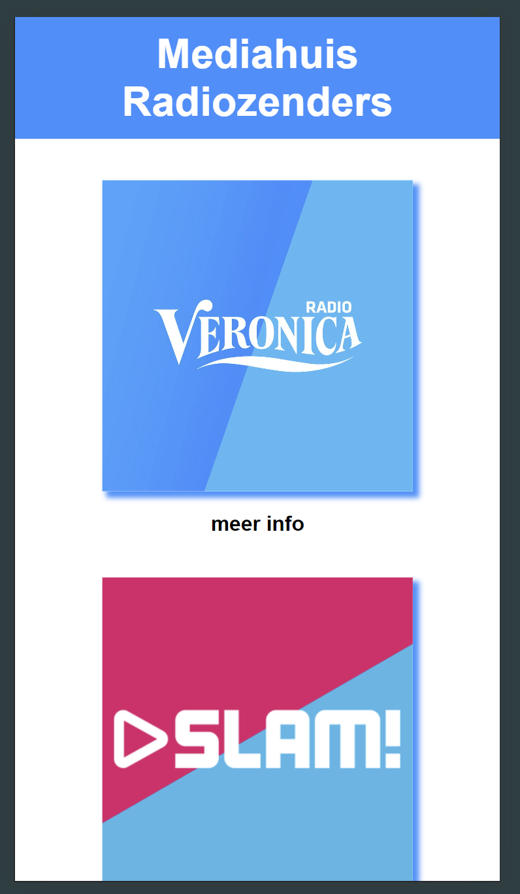
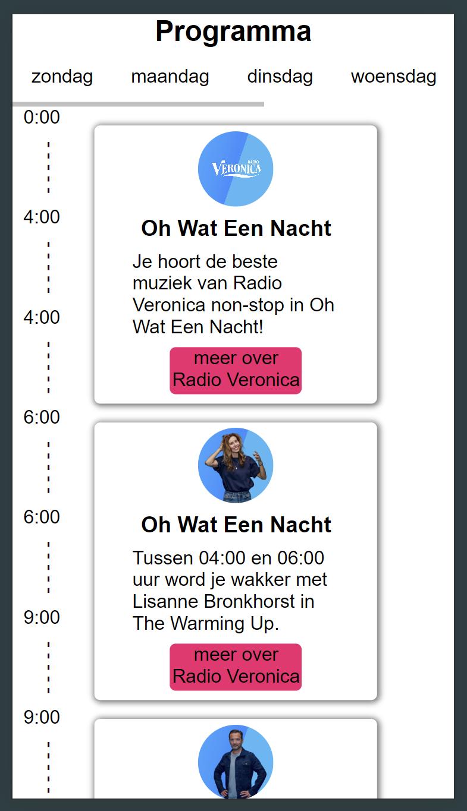
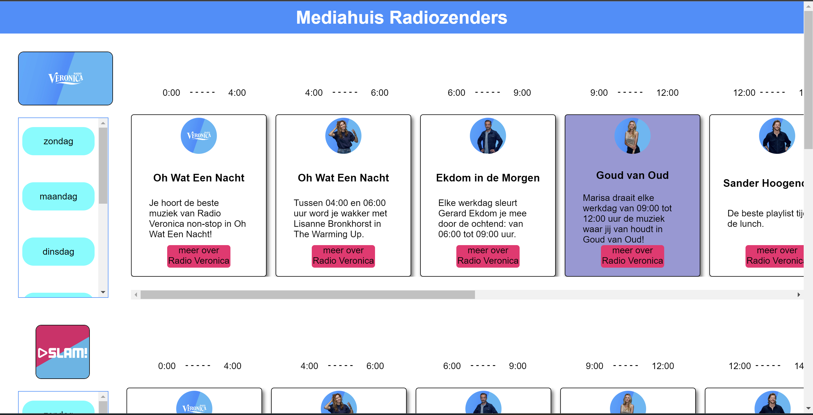

# Accessible Website

Ontwerp en maak voor een opdrachtgever een component/pagina/site toegankelijk volgens WCAG richtlijnen.

De instructie van deze leertaak staat in [INSTRUCTIONS](https://github.com/fdnd-task/all-human-accessible-website/blob/main/docs/INSTRUCTIONS.md)

## Inhoudsopgave

  * [Beschrijving](#beschrijving)
  * [Kenmerken](#kenmerken)
  * [Bronnen](#bronnen)
  * [Licentie](#licentie)

## Beschrijving
<!-- In de Beschrijving staat hoe je project er uit ziet, hoe het werkt en wat je er mee kan. -->
<!-- Voeg een mooie poster visual toe 📸 -->
<!-- Voeg een link toe naar Github Pages 🌐-->
Tijdens deze sprint heb ik me gefocust op het maken van een overzichtspagina.

Op de mobiele versie zijn op de landingspagina meerdere klikbare logo's toegevoegd. Wanneer erop geklikt wordt, opent het programma van die radiozender. Een highlight toont wat er op dat moment wordt uitgezonden.

Bij de desktopversie wordt optimaal gebruik gemaakt van de breedte van het scherm. Hier staan alle radiozenders onder elkaar en het programma is beschikbaar via een horizontale scroller, waarmee de gebruiker gemakkelijk door de shows kan navigeren.

## Kenmerken
<!-- Bij Kenmerken staat welke technieken zijn gebruikt en hoe. Wat is de HTML structuur? Wat zijn de belangrijkste dingen in CSS? Wat is er met Javascript gedaan en hoe? Misschien heb je een framwork of library gebruikt? -->
HTML
In de HTML maak ik gebruik van details-elementen, waarbij elk details-element een radiozender vertegenwoordigt.

CSS
Deze sprint heb ik mijn CSS beter georganiseerd. Vanaf het begin heb ik nesting toegepast, wat ervoor heeft gezorgd dat de code gedurende de hele sprint overzichtelijk en gestructureerd is gebleven.

JavaScript
Ik JavaScript gebruikt om ervoor te zorgen dat wanneer een nieuwe details-element wordt geopend, de andere automatisch sluiten. Dit voorkomt dat de mobiele versie te lang en onoverzichtelijk wordt.

Voor de desktopversie heb ik het summary-element niet nodig en hoeft het details-element niet open en dicht te klappen. Eerst heb ik de details-elementen geopend en daarna de detaile en summary elementen verborgen door ze op display: none te zetten. Dit heb ik gedaan met behulp van matchMedia, zodat het alleen op de desktopversie weg is.

Ook heb ik JavaScript toegepast om het huidige programma dat wordt afgespeeld te highlighten, zodat gebruikers gemakkelijk kunnen zien wat er op dat moment draait.

## Bronnen

## Licentie
This project is licensed under the terms of the [MIT license](./LICENSE).
